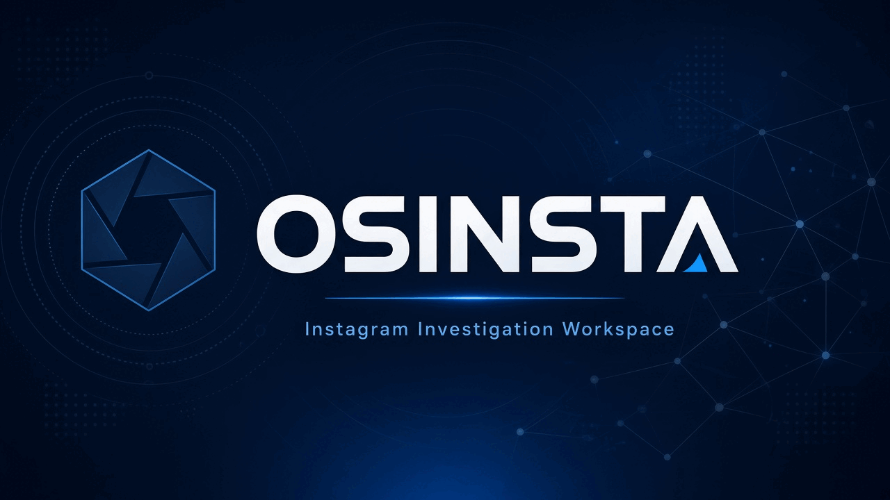

# Osinsta

<p align="center">
  
</p>

<p align="center">
  <strong>Advanced Instagram public OSINT toolkit</strong><br/>
  HikerAPI only · multi-select lookups · private/public modes · investigation reports
</p>

<p align="center">
  <a href="#quick-start"></a>
  <a href="#features"></a>
  <a href="#license"></a>
</p>

---

## Why Osinsta

Osinsta is built for investigators who want **Osintgram-style Instagram OSINT** with a cleaner workflow:

- **No Instagram username/password** — HikerAPI key only
- **Multi-select commands** → one investigation report
- **Public / Private mode** filters what you can safely run
- **Human-readable lookups** (not machine method names)
- **Downloadable HTML/JSON reports**
- **Case board**, watch/diff, risk score, contacts pack, timeline, geo clusters

> Private DMs, live GPS, and secret login email/phone are **not** supported.

## Features

| Area | What you get |
|---|---|
| Profile | Overview, about/history, photo, related accounts |
| Network | Followers, following, compare, tag/comment networks |
| Content | Hashtags, captions, geotags, likes/comments, posting schedule |
| Advanced | Private-safe scan, contacts pack, risk score, timeline, geo clusters, watch mode, export |
| Workspace | Multi-select UI, blue investigation theme, API key settings page, request balance |

## Quick start

```bash
git clone https://github.com/rohm8358/osinsta.git
cd osinsta
python3 -m venv .venv
source .venv/bin/activate
pip install -r requirements.txt

# Save HikerAPI key (https://hikerapi.com)
python -m osinsta set-token YOUR_HIKERAPI_TOKEN

# Web UI
python -m osinsta --web
# → http://127.0.0.1:8787
```

Or:

```bash
./run.sh
```

## CLI examples

```bash
python -m osinsta --list
python -m osinsta -t someuser -c private_recon
python -m osinsta -t someuser -c get_contacts
python -m osinsta -t someuser -c risk_score
python -m osinsta -t someuser -c export_report
```

## Web UI

1. Open **http://127.0.0.1:8787**
2. Click the masked **API key** chip to open settings / update key
3. Enter a target, choose **Public** or **Private**
4. Multi-select lookups → **Run selected**
5. Download the investigation report (HTML / JSON)

## Config

- Env: `HIKERAPI_TOKEN=...`
- File: `config/credentials.ini` (see `config/credentials.ini.example`)
- Local folders (gitignored): `cases/`, `watch/`, `output/`

## Disclaimer

Use only on accounts you are authorized to investigate. Respect Instagram terms, local law, and privacy.

## License

MIT — see [LICENSE](LICENSE).
