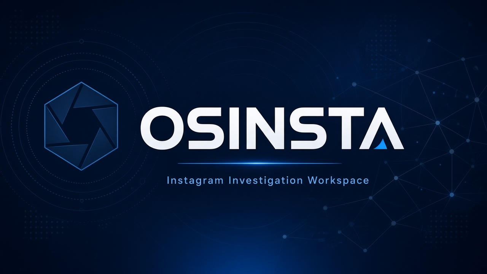
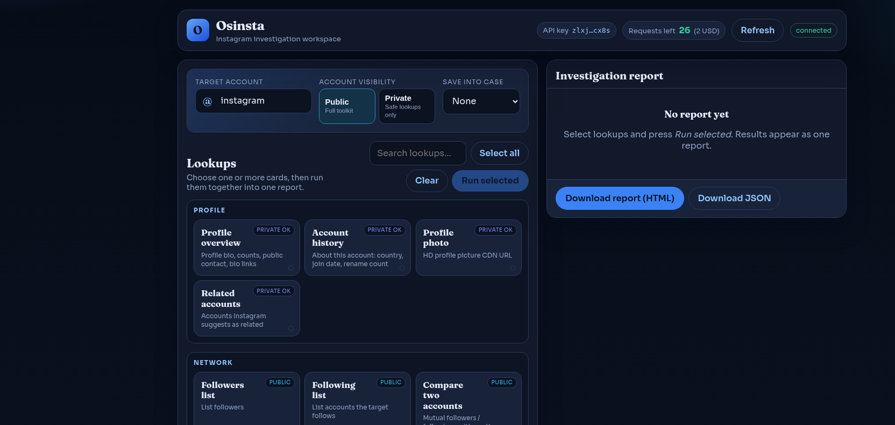

# Osinsta

<p align="center">
  
</p>

<p align="center">
  <strong>Advanced Instagram public OSINT toolkit</strong><br/>
  HikerAPI only · multi-select lookups · private/public modes · investigation reports
</p>

<p align="center">
  <a href="#why-osinsta"></a>
  <a href="#osinsta-vs-osintgram"></a>
  <a href="#quick-start"></a>
  <a href="#how-to-get-a-hikerapi-token"></a>
  <a href="#license"></a>
</p>

---

## Why Osinsta

Osinsta keeps the useful Instagram OSINT ideas from tools like Osintgram, then rebuilds the workflow for real investigations:

- **No Instagram username/password** — HikerAPI key only
- **Multi-select lookups** → one clean investigation report
- **Public / Private mode** shows only commands that make sense for that account
- **Human-readable lookup names** (not `get_user_info`-style machine labels)
- **Downloadable HTML/JSON reports**
- **Advanced modules**: case board, watch/diff, risk score, contacts pack, timeline fusion, geo clusters, caption intel, cost planner

> Private DMs, live GPS, and secret login/recovery email or phone are **not** supported.

---

## Osinsta vs Osintgram

| | **Osintgram** | **Osinsta** |
|---|---|---|
| Auth to start | HikerAPI **or** Instagram login (instagrapi) | **HikerAPI only** — no IG username/password |
| Command UX | Machine-style command list / AI picker | Human labels + hover descriptions + multi-select cards |
| Private accounts | Many commands hard-stop on private | **Private mode** keeps private-safe lookups available |
| Running lookups | Usually one flow / selected tools | Select **many lookups at once** |
| Results | Cards / tool outputs | **Single investigation report** + download HTML/JSON |
| API key UX | Paste key in UI | Masked key in header + dedicated **settings page** to verify/update |
| Quota visibility | Balance support | Requests remaining shown live in header |
| Investigation workflow | Strong fetching layer | Adds **case board**, watch snapshots/diff, export packs |
| Analysis extras | Core Instagram fetches | **Risk score**, contacts pack, bio-link expander, timeline fusion, geo clusters, caption intel, comment network, graph overlap, cost planner |
| Design | Terminal / utility feel | Blue investigation workspace built for operators |

### Why Osinsta is more advanced

1. **Operator workflow, not just API wrappers** — multi-select → report → download is how investigations are documented.
2. **Private-aware by design** — filters the toolkit for private accounts instead of failing late.
3. **No Instagram session risk** — never stores IG passwords or fights 2FA just to start.
4. **Enrichment layer** — contacts pack, risk heuristics, timeline/geo/caption intel, change detection.
5. **Case memory** — save targets/findings; watch mode tracks profile changes over time.
6. **Clearer product UX** — readable names, report UI, API key page, live remaining requests.

Osintgram is excellent as a data-fetching / AI-assisted lookup shell. **Osinsta is built as an investigation workspace on top of that concept.**

---

## Features

| Area | What you get |
|---|---|
| Profile | Overview, about/history, photo, related accounts |
| Network | Followers, following, compare, tag/comment networks |
| Content | Hashtags, captions, geotags, likes/comments, posting schedule |
| Advanced | Private-safe scan, contacts pack, risk score, timeline, geo clusters, watch mode, export |
| Workspace | Multi-select UI, blue theme, API key settings page, request balance, report download |

---

## Quick start

```bash
git clone https://github.com/rohm8358/osinsta.git
cd osinsta
python3 -m venv .venv
source .venv/bin/activate
pip install -r requirements.txt

python -m osinsta set-token YOUR_HIKERAPI_TOKEN
python -m osinsta --web
# → http://127.0.0.1:8787
```

Or:

```bash
./run.sh
```

### CLI examples

```bash
python -m osinsta --list
python -m osinsta -t someuser -c private_recon
python -m osinsta -t someuser -c get_contacts
python -m osinsta -t someuser -c risk_score
python -m osinsta -t someuser -c export_report
```

---

## Web UI

<p align="center">
  
</p>

1. Open **http://127.0.0.1:8787**
2. Click the masked **API key** chip → settings page to update/verify key
3. Enter a target, choose **Public** or **Private**
4. Multi-select lookups → **Run selected**
5. Download the investigation report (**HTML** / **JSON**)

---

## How to get a HikerAPI token

Osinsta uses [HikerAPI](https://hikerapi.com) as the Instagram data backend.

1. Open **[https://hikerapi.com](https://hikerapi.com)**
2. Create an account / sign in
3. Go to your dashboard / API section and **create or copy your API token**
4. Check billing / balance so you have requests available: **[https://hikerapi.com/billing](https://hikerapi.com/billing)**
5. Put the token into Osinsta using any one method:

```bash
# Option A — CLI
python -m osinsta set-token YOUR_HIKERAPI_TOKEN

# Option B — environment variable
export HIKERAPI_TOKEN=YOUR_HIKERAPI_TOKEN

# Option C — config file
cp config/credentials.ini.example config/credentials.ini
# then set: hikerapi_token = YOUR_HIKERAPI_TOKEN
```

6. Or in the web UI: open **http://127.0.0.1:8787/settings**, paste the key, **Verify & update**

The header shows a **masked** key and **requests remaining**. If requests hit `0`, top up at HikerAPI billing before running more lookups.

## Config

- Env: `HIKERAPI_TOKEN=...`
- File: `config/credentials.ini` (see `config/credentials.ini.example`)
- Local folders (gitignored): `cases/`, `watch/`, `output/`

## Disclaimer

Use only on accounts you are authorized to investigate. Respect Instagram terms, local law, and privacy.

## License

MIT — see [LICENSE](LICENSE).
